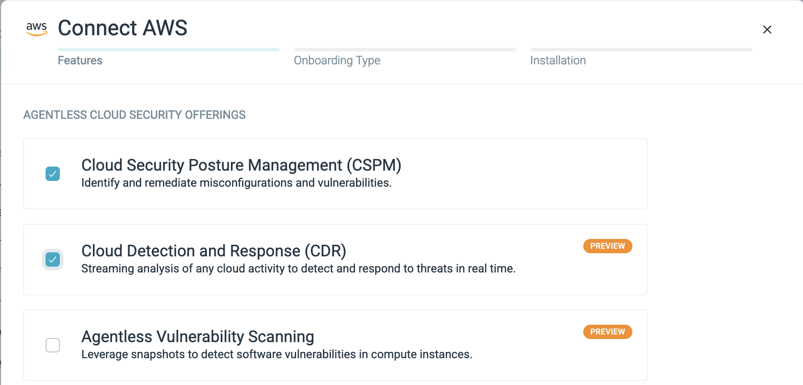

# Example / Demo / Testing Scenarios for Sysdig Secure

These are the Kubernetes manifests and scripts from the Sysdig EKS Workshop - https://github.com/jasonumiker-sysdig/sysdig-aws-workshop-instructions

I provide them here so that you can run through that workshop on your own cluster/environment (independent of Sysdig).

## Prerequisites (Optional if you want to do the AWS Cloud Detection and Response steps - otherwise any Kubernetes is fine)

You need to have:
* An AWS EKS Cluster
  * With an IAM OIDC provider enabled for IRSA - https://docs.aws.amazon.com/eks/latest/userguide/enable-iam-roles-for-service-accounts.html
* A machine that is able to run kubectl commands against it (i.e. you've already run the `aws eks update-kubeconfig` with the right AWS IAM available to do so etc.)
* A Sysdig Secure subscription with both the EKS Cluster and the AWS Account connected.

### Connecting the EKS Cluster to Sysdig

This is the Sysdig Helm Chart values file we use in the workshop. I haven't moved to the cluster scanner yet because the workshop is a single-node cluster so it doesn't really matter/help there.
```
global:
  sysdig: 
    accessKey: XXX
    region: au1
    secureAPIToken: YYY
  kspm:
    deploy: true
  clusterConfig:
    name: ZZZ
nodeAnalyzer:
  secure:
    vulnerabilityManagement:
      newEngineOnly: true
  nodeAnalyzer:
    benchmarkRunner:
      deploy: false
    runtimeScanner:
      settings:
        eveEnabled: true
    hostScanner:
      scanOnStart: true
admissionController:
  enabled: true
  scanner:
    enabled: false
  webhook:
    autoscaling:
      minReplicas: 1
```

### (Optional if you want to do the AWS Cloud Detection and Response steps) Connecting the AWS Account to Sysdig
We have connected the workshop AWS account with agentless CSPM and CDR - and assume that you'll have these enabled in your account as well:



## Configuring Sysdig Secure's Runtime Policies

The Workshop assumes that you have your Runtime Policies configured in the following way:

### AWS CloudTrail
You will create two custom policies (click the Add Policy button in the upper right and choose AWS CloudTrail):
* SSM Session Manager Connect
    * Scope it to Entire Infrastructure
    * Include the rule SSM Start Session (Import it from Library)
* Make Bucket Public
    * Scope it to Entire Infrastructure
    * Include the rules (Import them from Library):
        * Delete Bucket Public Access Block
        * Put Bucket ACL for AllUsers
        * Put Bucket Policy

### Workload
Enable the following Managed Policies:
* Sysdig Runtime Threat Detection
* Sysdig Runtime Threat Intelligence
* Sysdig Runtime Notable Events

### Kubernetes Audit
Enable the Managed Policy Sysdig K8s Notable Events

### Container Drift 
You will create four custom policies (click the Add Policy button in the upper right and choose Container Drift):
* Detect Container Drift (security-playground)
    * Scope it to kubernetes.namespace.name = security-playground
    * Ensure Actions -> Prevent is off
* Detect Container Drift (security-playground-restricted)
    * Scope it to kubernetes.namespace.name = security-playground-restricted
    * Ensure Actions -> Prevent is off
* Detect Container Drift (security-playground-restricted-nomalware)
    * Scope it to kubernetes.namespace.name = security-playground-nomalware
    * Ensure Actions -> Prevent is off
* Prevent Container Drift (security-playground-restricted-nodrift)
    * Scope it to kubernetes.namespace.name = security-playground-restricted-nodrift
    * Ensure Actions -> Prevent is **on**

### Malware
You will create two custom policies (click the Add Policy button in the upper right and choose Malware):
* Detect Malware
    * Scope it to Entire Infrastructure
    * Ensure Actions -> Prevent is off
* Prevent Malware (security-playground-restricted-nomalware)
    * Scope it to kubernetes.namespace.name = security-playground-restricted-nomalware
    * Ensure Actions -> Prevent is **on**

## Deploy the Kubernetes Manifests
Ensure your kubectl is working for the intended cluster and you are in the example-scenarios folder then run the following command `kubectl apply -k k8s-manifests`

## (Optional if you want to do the AWS Cloud Detection and Response steps) Set up the IRSA Role
Edit the [create-irsa](./create-irsa.sh) script to include the cluster name and region and then run that script to create the AWS IAM Role `irsa` and a matching service-account named `irsa` that we'll assign to the security-playground giving it over-provisioned access to S3 in the workshop.

NOTE: You'll need to have enabled OIDC on the cluster you are testing against by following the instructions at https://docs.aws.amazon.com/eks/latest/userguide/enable-iam-roles-for-service-accounts.html

## Do the workshop!
The scripts that you would expect to be on the Jumpbox are all in the scripts folder.

Assuming you configured everything as above, it should now work the same as if it was in the lab environment provided by Sysdig during the workshop.

NOTE: The scripts expect to be able to hit a NodePort on the cluster's Node(s) and so likely need to be run from a machine on the same VPC or connected private network in order for them to work. Worst case you can spin up an EC2 instance in that same VPC to run them on (like we do in the workshop).
